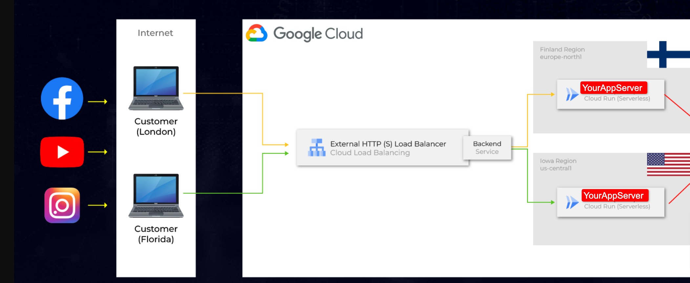

# Geo location based load balancing
Creating loadbalancer to divert traffic to respective region of request.

## Implementation
In following example we will deploy the servers to europe and america. So will call the server as finland and usa.

Enable the following API
- Compute Engine API
- Cloud Build API
- Cloud Run API

Download your application server(which can be deployed via Docker).

**Creating a Container Image and deploying via Cloud Run to Finland**

Go to the folder of the Finland application files:
- `cd finland`

Running the Cloud Build in the container image:
- `gcloud builds submit --tag gcr.io/$DEVSHELL_PROJECT_ID/appmyserverfinland`

Just waiting for the SUCCESS status, and then, go to the next step!

Deploying the application using the Cloud Run.
- `gcloud run deploy --image gcr.io/$DEVSHELL_PROJECT_ID/appmyserverfinland --port 5000 --platform managed`
Press Enter to confirm the default application name: appmyserverfinland
Select the region, europe-north1, typing the number: 13
Allow unauthenticated requests by typing:  y

**Creating a Container Image and deploying via Cloud Run to USA**

Go to the folder of the Finland application files:
- `cd usa`

Running the Cloud Build in the container image:
- `gcloud builds submit --tag gcr.io/$DEVSHELL_PROJECT_ID/appmyserverusa`

Just waiting for the SUCCESS status, and then, go to the next step!

Deploying the application using the Cloud Run.
- `gcloud run deploy --image gcr.io/$DEVSHELL_PROJECT_ID/appmyserverusa --port 5000 --platform managed`

Press Enter to confirm the default application name: appmyserverfinland
Select the region, europe-north1, typing the number: 27
Allow unauthenticated requests by typing:  y

**Deploying of the External HTTP Load Balancer**  
Creating 2 serverless NEG for Finland and USA servers:
- `gcloud compute network-endpoint-groups create sneg-appmyserverfinland --region=europe-north1 --network-endpoint-type=serverless --cloud-run-service=appmyserverfinland`
- `gcloud compute network-endpoint-groups create sneg-appmyserverusa --region=us-central1 --network-endpoint-type=serverless --cloud-run-service=appmyserverusa`

Creating the backend service global
- `gcloud compute backend-services create myserver-backend-global --global`

Adding the serverless NEG created to the backend service global:
- `gcloud compute backend-services add-backend myserver-backend-global --global --network-endpoint-group=sneg-appmyserverfinland --network-endpoint-group-region=europe-north1`
- `gcloud compute backend-services add-backend myserver-backend-global --global --network-endpoint-group=sneg-appmyserverusa --network-endpoint-group-region=us-central1`

Creating an URL map to redirect the incoming requisitions to the backend service:
- `gcloud compute url-maps create lb-myserver-global --default-service myserver-backend-global`

Creating the target HTTP(S) proxy to redirect the requisitions to the URL map
- `gcloud compute target-http-proxies create lb-myserver-httpproxy --url-map=lb-myserver-global`

Reserving an IP address to the External HTTP Load Balancer
- `gcloud compute addresses create myserver-global-ip --ip-version=IPV4 --global`

Use this commando below to check the IP of the myserver-global-ip
- `gcloud compute addresses describe myserver-global-ip --format="get(address)" --global`

Creating a global forwarding rule to redirect the incoming requisitions to the Proxy (Frontend).
- `gcloud compute forwarding-rules create myserver-frontend-global --address=myserver-global-ip --target-http-proxy=lb-myserver-httpproxy --global --ports=80`

Installing a VPN Extension in the Chrome browser for testing.
- Extension name: Free VPN for Chrome - VPN Proxy VeePN