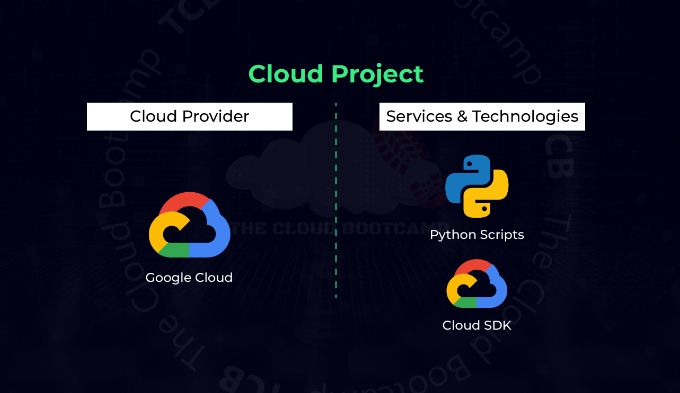
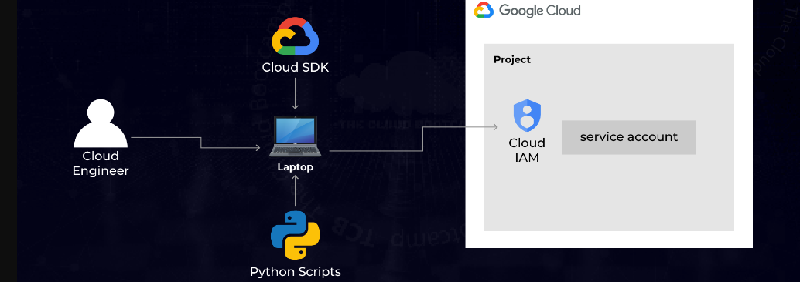

# _Automation Using Python on Google Cloud - IAM Service Accounts_

**Project description**

In this real world-based project, I acted as a Cloud Specialist and used IAM services to create a Service Account. This service account allowed communication via scripts within the architecture through Cloud SDK and Python Scripts.

**Project Overview**

Requirements were to proivde scripts to access google cloud storage externally. As shown below, external services(python script in this particular case) shall be able to access cloud storage.

**Project Implementation**

In this project, 
- We created a service account with a google cloud storage access role. 
- Created a key for respective service account. 
- Used the key to access the google cloud storage via a python script. 

